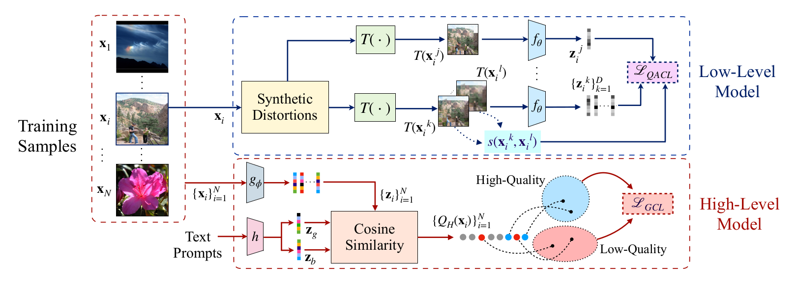

# <p align="center">GRepQ</p>
Official repository for our WACV 24 paper titled [Learning Generalizable Perceptual Representations for Data-Efficient No-Reference Image Quality Assessment](http://arxiv.org/abs/2312.04838).



## Environment ##

The code has been implemented with:

* Python **3.8.18**
* Pytorch **2.0.1**
* Torchvision **0.15.2**
* Cuda **11.8**
* Cudnn **8.7.0**

## Getting Started ##

## Training ##

#### Data Preparation ####

For the low level model, the data is expected to be arranged as 
directories. Each directory corresponds to an image and within each
folder, multiple distorted versions of the image are present. For 
example, the data is expected to be arranged in the following 
format
```
    - datatset
        - image1
            - image1_distortion1.png
            - image1_distortion2.png
            ...
            - image1_distortionK.png
        - image2
            - image2_distortion1.png
            - image2_distortion2.png
            ...
            - image2_distortionK.png
```

The high level model also expects the dataset to be arranged in a 
similar manner. The high level model only uses the reference images,
and doesn't require distorted versions.

Create a directory `Results` and within it two subdirectories
`LLM` and `HLM` for saving the trained models. 
The high and low level models can be trained using the command
```
    python train.py
```

For training either model, the parameters in `configs.py` can be 
modified.

## Evaluation ##


Install all the required packages and dependencies. 

**NOTE:** This codebase requires CLIP to be installed. 
To install CLIP, please follow the instructions given
in [CLIP](https://github.com/openai/CLIP).

Once CLIP is installed, the positional embedding needs to be disabled in
the forward pass of the image encoder. This can be done by commenting the
positional embedding step in the forward pass of the image encoder in 
CLIP's `model.py`.
```
    # x = x + self.positional_embedding[:, None, :].to(x.dtype)  # (HW+1)NC
```

### Pretrained Weights ###

The pretrained weights and pristine patches are available 
at this 
[Google drive](https://drive.google.com/drive/folders/1wLpdN6TNezur_0_NF7XgmBMyWcSxH5eX?usp=drive_link) link.

1. Create a directory named `pretrained_weights` inside the `Evaluation` folder
and copy the low and high level model weights into this. 
2. Copy the pristine 
image patches file `pristine_patches_096_0.75_0.80.hdf5` into the main working 
directory.

### Testing on a Single Image (Zero Shot) ###

In order to obtain the zero shot individual high and low level quality scores, run 
the following
```
    python test_zeroshot.py --eval_type zeroshot_single_img --test_img_path PATH_TO_IMAGE
```
### Testing on a Dataset (Zero Shot) ###

To test on entire datasets, for example on CLIVE or KonIQ-10k, run the following
commands:
```
    python test_zeroshot.py --eval_type zeroshot --dataset 'CLIVE'
    python test_zeroshot.py --eval_type zeroshot --dataset 'KONIQ'
```

### Data Efficient Evaluation ###

For the data efficient setting, the features can be computed using 
`get_concatenated_features.py`, which will be saved in the 
`Evaluation` folder. An SVR (ridge regression) can be 
trained using these features. The ridge regression parameter `alpha` 
can be tuned to obtain optimal performance. For our experiments, 
`alpha` was chosen from the set `{0.1, 1, 10, 100}`.

## Citation
If you find this work useful for your research, please cite our paper:
```
@InProceedings{Srinath_2024_WACV,
    author    = {Srinath, Suhas and Mitra, Shankhanil and Rao, Shika and Soundararajan, Rajiv},
    title     = {Learning Generalizable Perceptual Representations for Data-Efficient No-Reference Image Quality Assessment},
    booktitle = {Proceedings of the IEEE/CVF Winter Conference on Applications of Computer Vision (WACV)},
    month     = {January},
    year      = {2024},
    pages     = {22-31}
}
```

## License ##

MIT License

Copyright (c) 2023 Suhas Srinath, Shankhanil Mitra, Shika Rao, Rajiv Soundararajan

Permission is hereby granted, free of charge, to any person obtaining a copy
of this software and associated documentation files (the "Software"), to deal
in the Software without restriction, including without limitation the rights
to use, copy, modify, merge, publish, distribute, sublicense, and/or sell
copies of the Software, and to permit persons to whom the Software is
furnished to do so, subject to the following conditions:

The above copyright notice and this permission notice shall be included in all
copies or substantial portions of the Software.

THE SOFTWARE IS PROVIDED "AS IS", WITHOUT WARRANTY OF ANY KIND, EXPRESS OR
IMPLIED, INCLUDING BUT NOT LIMITED TO THE WARRANTIES OF MERCHANTABILITY,
FITNESS FOR A PARTICULAR PURPOSE AND NONINFRINGEMENT. IN NO EVENT SHALL THE
AUTHORS OR COPYRIGHT HOLDERS BE LIABLE FOR ANY CLAIM, DAMAGES OR OTHER
LIABILITY, WHETHER IN AN ACTION OF CONTRACT, TORT OR OTHERWISE, ARISING FROM,
OUT OF OR IN CONNECTION WITH THE SOFTWARE OR THE USE OR OTHER DEALINGS IN THE
SOFTWARE.

